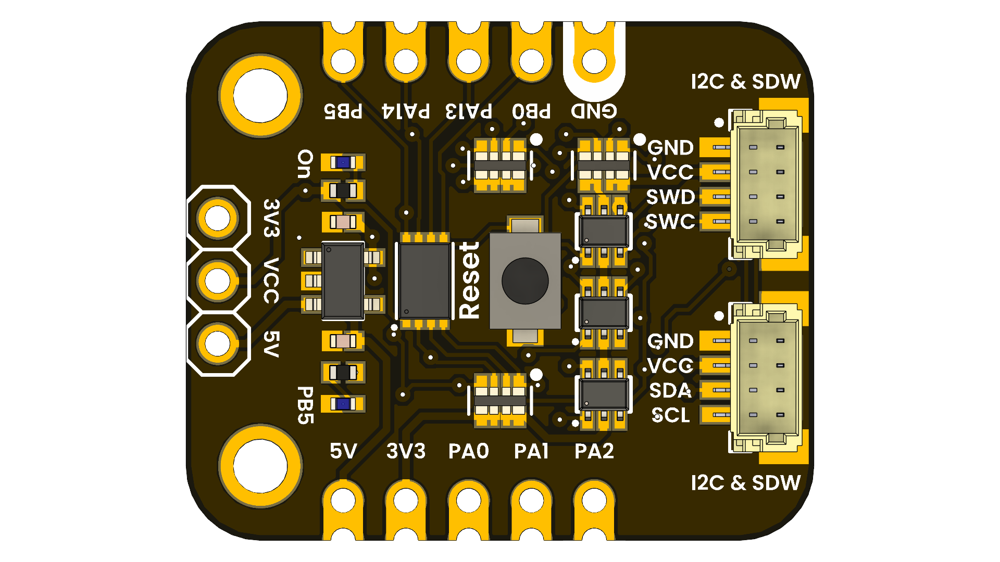

# DevLab: PY32F003L24D6TR MCU Dev Board

## Introduction

The DevLab Development Board based on the PY32F003L24D6TR microcontroller is designed for rapid prototyping, embedded systems education, IoT experimentation, and wearable devices. This board combines flexible power options, modern connectivity, and accessible interfaces to accelerate your hardware development. The microcontroller features a 32-bit ARM Cortex-M0 core, up to 24 MHz clock speed, 16KB Flash memory, and 2KB SRAM, making it suitable for a wide range of applications. With built-in peripherals like SPI, I2C, UART, and a 12-bit ADC, the board supports diverse project requirements.

  
  
<em>PY32f003L24D6TR Devlab</em>

### Quick Setup

## Overview

| Feature                      | Description                        |
|------------------------------|------------------------------------|
| Microcontroller              | PY32F003L24D6TR (32-bit ARM Cortex-M0) |
| Flash (Kbytes)               | 16                                 |
| SRAM (Kbytes)                | 2                                  |
| Advanced Timers (16-bit)     | 1                                  |
| General Purpose Timers       | 4                                  |
| Low Power Timer              | 1                                  |
| SysTick                      | 1                                  |
| Watchdog                     | 2                                  |
| SPI                          | 1                                  |
| I2C                          | 1                                  |
| USART                        | 1                                  |
| DMA Channels                 | 3                                  |
| RTC                          | Yes                                |
| GPIOs                        | 7                                  |
| 12-bit ADC (ext+int)         | 4+2                                |
| Comparators                  | 2                                  |
| Max. CPU Frequency (MHz)     | 24                                 |
| Operating Voltage (V)        | 1.7 ~ 5.5                          |

## Use Cases

- Device Prototyping
- Embedded Systems Education
- Networked  Alambric Devices
- Wearable Technology Development

##  Resources

- [Schematics](hardware/unit_schematic_v_0_0_1_ue0102_PY32f003L24D6TR_devlab.pdf)
- [Datasheet](hardware/resources/PY32F003L24_datasheet.pdf)

## License

All hardware and documentation in this project are licensed under the **MIT License**.  
Please refer to [`LICENSE.md`](LICENSE.md) for full terms.

  Template created by UNIT Electronics 

