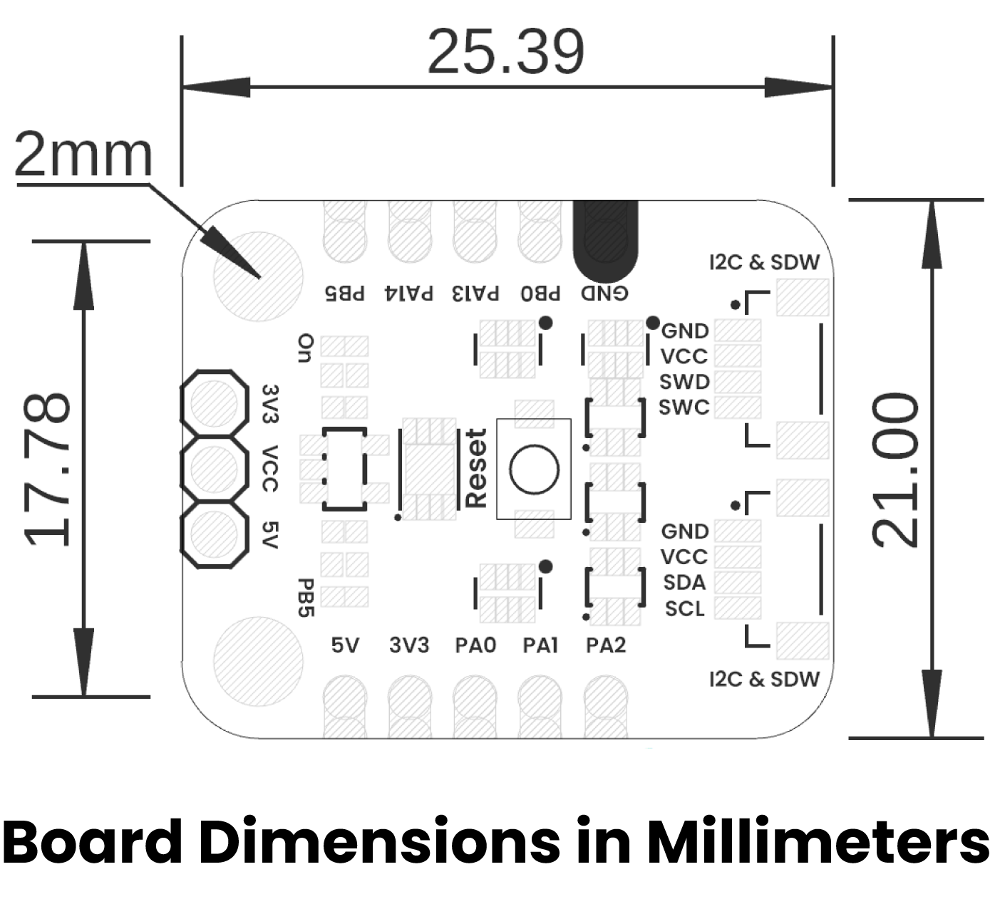

# Hardware

<a href="./unit_schematic_v_0_0_1_ue0102_PY32f003L24D6TR_devlab.pdf">  Schematics</a>

---

## ⚙️ Technical Specifications

- **Microcontroller:** [Insert name and variant]
- **Core Architecture:** [Xtensa / ARM Cortex-M / RISC-V]
- **Clock Speed:** [e.g., 240 MHz]
- **Flash / RAM:** [e.g., 8 MB Flash, 2 MB PSRAM]
- **Wireless:** [2.4 GHz Wi-Fi, BLE 5.0]
- **Interfaces:**
  - UART / I2C / SPI / PWM
  - USB Device or Host (if supported)
- **Power:**
  - Input via USB-C: 5V
  - Regulated Output: 3.3V
  - Battery Support: [Yes / No]
- **Dimensions:** [e.g., 55mm x 25mm]

## 🔌 Pinout

Include a diagram like `docs/pinout.png` or describe functionally:

| Pin Label | Function        | Notes                             |
|-----------|------------------|-----------------------------------|

## 📏 Board Dimensions

<a href="./resources/unit_dimension_v_0_0_1_ue0102_PY32f003L24D6TR_devlab.png"> Dimensions</a>

## 📃 Board Topology

<a href="./resources/unit_topology_v_0_0_1_ue0102_PY32f003L24D6TR_devlab.png"> Topology</a>

| Ref.  | Description                                                                 |
|-------|-----------------------------------------------------------------------------|
| IC1   | PY32f003L24D6TR Microcontroller                                             |
| U1    | AP2112K 3.3V Regulator                                                      |
| SW1   | Reset Push Button                                                           |
| L1    | Power On LED                                                                |
| L2    | Built In LED to PB5                                                         |
| J1    | JST 1mm Connector for I2C or JTAG                                           |
| J2    | JST 1mm Connector for I2C or JTAG                                           |
| J3    | JST 1mm Connector for SPI                                                   |
| JP1   | Header for GPIOs                                                            |
| JP2   | Header for GPIOs                                                            |
| JP3   | Header for Power Supply Selection                                           |
| SB1   | Solder Bridge to Enable LED Built In                                        |

## References
